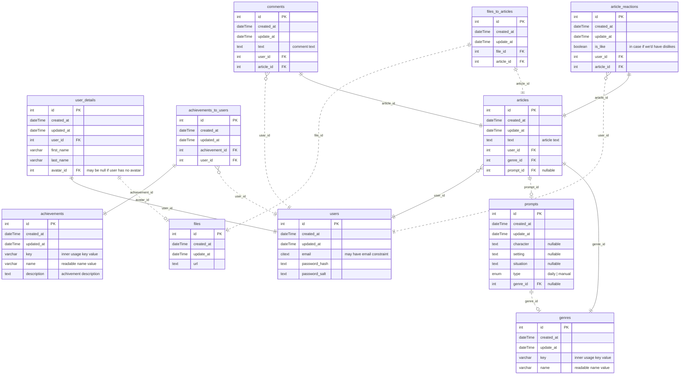

## ℹ️ General Info

Test task

## 🖍 Requirements

- [NodeJS](https://nodejs.org/en/) (18.x.x);
- [NPM](https://www.npmjs.com/) (9.x.x);
- [PostgreSQL](https://www.postgresql.org/) (15.4)
- run **`npx simple-git-hooks`** at the root of the project, before the start (it will set the [pre-commit hook](https://www.npmjs.com/package/simple-git-hooks) for any commits).

## 🏃‍♂️ Simple Start

1. **`npm install`** at the root
2. Fill ENVs
3. **`npx simple-git-hooks`** at the root
4. **`cd backend && npm run migrate:dev`**
5. **`cd frontend && npm run start:dev`** then **`cd backend && npm run start:dev`**
6. Enjoy <3

## 🏗 Architecture

### 🛖 Application Schema

TBA

### 💽 DB Schema

### 🌑 Backend

- [Fastify](https://www.fastify.io/) — a backend framework.
- [Knex](https://knexjs.org/) — a query builder.
- [Objection](https://vincit.github.io/objection.js/) — an ORM.

### 🌕 Frontend

- [React](https://reactjs.org/) — a frontend library.
- [Redux](https://redux.js.org/) + [Redux Toolkit](https://redux-toolkit.js.org/) — a state manager.
